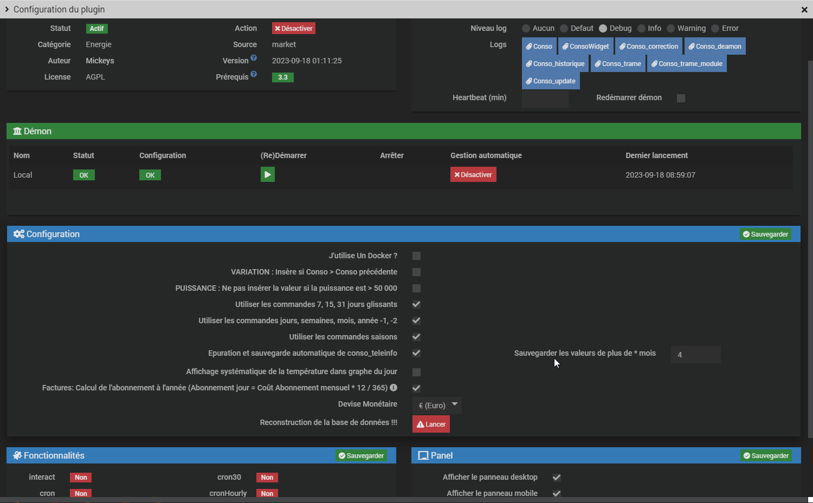
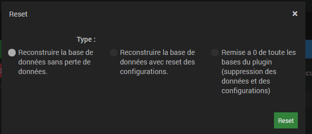

# Configuration du plugin

Il y a quelques paramètres à mettre à jour dans la configuration générale du plugin 
_**Plugins / Energie / Suivi Conso / configuration**_  

**J'utilise Un Docker ?** : Comme son libellé l'indique, à cocher si votre Jeedom est sous Docker  

**VARIATION : Insere si Conso > Conso précedente** : Permet de ne pas prendre en compte l'index si sa valeur est plus petite que la fois précédente. Pour éviter les aberrations de consommations (ne pas utiliser si les équipements ont tendance à repasser à 0 de temps en temps) 

**PUISSANCE : Ne pas insérer la valeur si la puissance est > 50 000** : Pour éviter de prendre en compte des valeurs de report de puissance fantaisistes et de fausser ainsi les calculs.  

**Utiliser les commandes 7, 15, 31 jours glissants** : Cocher cette case permet de créer pour chaque équipement les commandes de report de consommations et de coûts pour les 7, 15, 31 derniers jours glissants.  

**Utiliser les commandes jours, semaines, mois, année -1, -2** : Cocher cette case permet de créer pour chaque équipement les commandes de report de consommations et de coûts pour les jours -1, -2, semaines -1, -2, mois -1, -2, année -1, -2.  

**Utiliser les commandes saisons** : Cocher cette case permet de créer pour chaque équipement les commandes de report de consommations et de coûts pour les 4 saisons passées (Printemps, Eté, Automne, Hivers).  

**Epuration et sauvegarde automatique de conso_teleinfo** : Permet d'épurer la table conso_teleinfo (relevé détaillé des infos sur la journée) en fonction d'un délai en mois renseigné dans le champs: 'Sauvegarder les valeurs de plus de * mois'. Les informations épurées seront stockées dans un fichier zip se trouvant dans le répertoire backup.

**Devise Monétaire** : Choix de la devise monétaire apparaissant dans le dashboard et les factures 

**Reconstruction de la base de données !!!** : Permet de réparer la base de données du plugin en cas de problème. _**Cet outil est à utiliser avec précaution et en ayant fait une sauvegarde préalable**_  

