Pour accéder au panel, allez dans l'onglet Accueil / Suivi Conso

## Le menu


Les onglets de paramétrages sont en vert

## Accueil
La page d'accueil vous permet de visualiser sur une même page les informations les plus importantes 

### Prix 
Ce tableau retourne le coût de votre consommation par Jour / Semaine / Mois et Année. 

Vous pouvez afficher le détail en vous positionnant sur le libellé 

**HP/HB TTC et HC TTC :** Prix HT + TVA 

**TOTAL TTC :** Prix TTC + Abonnement + TVA + Taxes 

Année : vous pouvez paramétrer la date de début de votre année dans l'onglet outil


### Watt  
Ce Tableau vous affiche la consommation par Jour / Semaine / Mois et Année. 

Vous pouvez afficher le détail en vous positionnant sur le libellé 
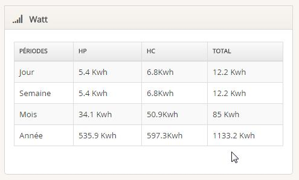

### Prévisions
Les prévisions seront affichées uniquement si vous avez un historique d'1 an minimum pour pouvoir comparer sur l'année précédente. 
La prevision par année est calculée en Year to month. de janviers au dernier mois complet  
Si nous sommes en septembre alors la comparaison se fera : 
01/01/2017-> 31/08/2017 à 01/01/2016-> 31/08/2016 <br>
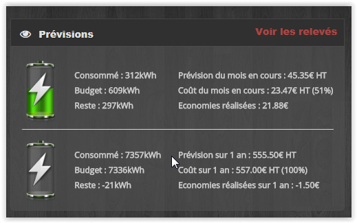


### Puissance 
Puissance instantanée sous forme de jauge


### Variation 
Ce Tableau vous informe des variations de puissance 
Il vous permet de voir la différence de puissance entre chaque relevé 
Heure / puissance / Différence par rapport au dernier relevé / Type Abonnement
 
**Il est possible que ce tableau ne s'affiche pas lors du lancement du plugin , il faut alors attendre quelque heures.** <br>
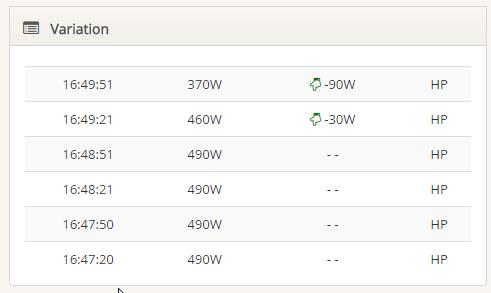

**Statistique**
 - Du jour , de la semaine, du mois , de l'année disponible en cliquant sur les flèches
 - Consommation par équipement 
 - La consommation  
 - Pourcentage en HP et HC 
 - Consommation du jour 
 
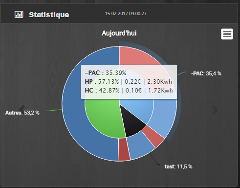


**Graphique du jour**
 - La puissance instantanée 
 - La consommation du jour 
 - La consommation de la veille 
 - La puissance maximale et minimale du jour 

**Graphique en Bar** 
 - Consommation des 7 derniers jours (en Kwh ) 
 - Consommation du mois par semaine (en Kwh ) 
 - Consommation par mois sur 1 an (en Kwh ) 
 - Consommation des 7 derniers jours (en euro ) 
 - Consommation du mois par semaine (en euro ) 
 - Consommation par mois sur 1 an (en euro ) 

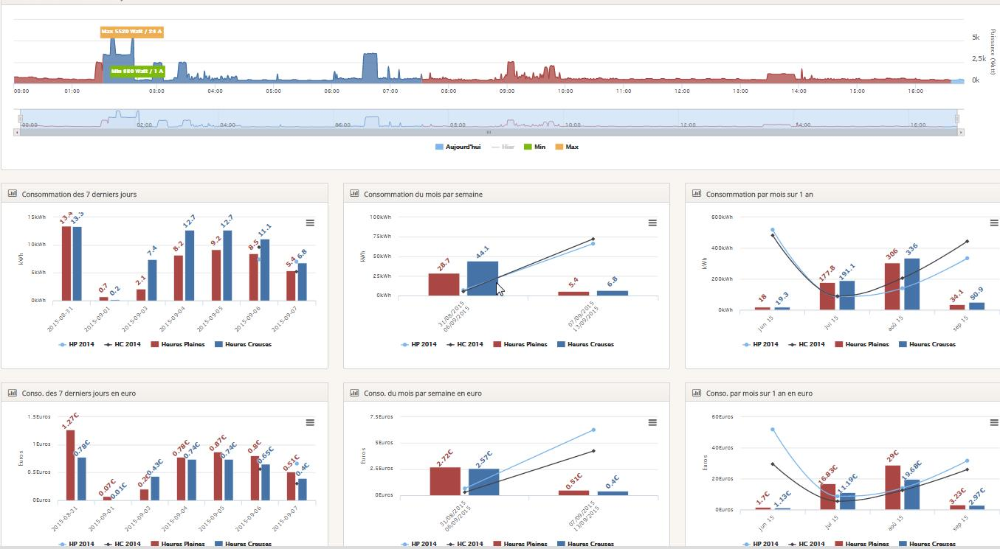

En passant la souris sur le graphique vous pouvez afficher le detail. 

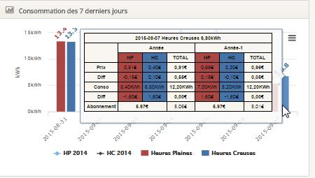


Le dernier tableau est un graphique TTC 

**Taxe Fixe :** Abonnement + Taxes fixes paramétrées dans l'onglet Taxes + TVA 

**Taxe Variable :** Taxes variables paramétrées dans l onglet Taxes + TVA

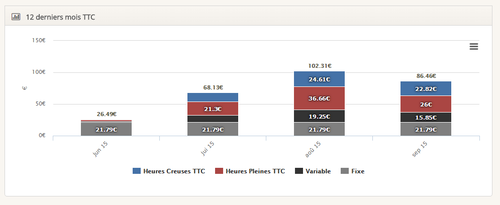


## Factures
Cet onglet vous permet d 'afficher les factures EDF, Gaz, Eau, Fioul elles sont générées automatiquement en fonction des paramètres Prix , Taxe, Abonnement et TVA 
Pour générer une facture il faut ajouter une période onglet "Périodes" du menu 

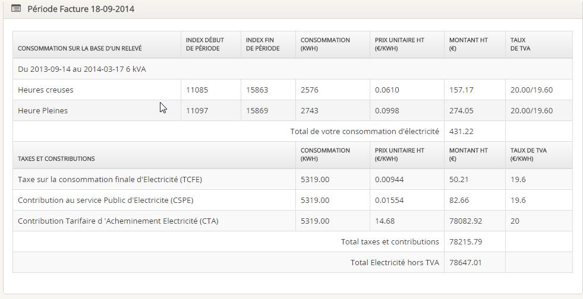


## Graphiques
Cet onglet vous permet d'afficher des graphiques selon une période définie dans l'onglet "Périodes". 

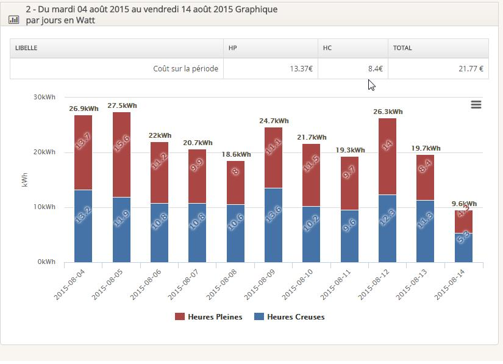


## Périodes
Grace a cet onglet vous allez pouvoir générer des factures et des graphiques selon une borne de date. 


Pour créer une periode il faut cliquer sur "Ajouter une période" 

**Libelle** : nom de votre période ( c'est le titre de votre facture et/ou de votre graphique ) <br>
**Date début :** début de votre facture ou/et graphique <br>
**Date fin :**  fin de votre facture et/ou graphique <br>
**Affichage  ( HP , HB ,HC ) :** type de graphique ( en ligne , en bar ..) pour chaque index. <br>
**Regrouper par :** jour , semaine , mois <br>
**Type  :** Watt ou Euro <br>
**Affichage Facture :** générer une facture pour cette période ( oui ou non ) <br>
**Affichage Graphique :** générer un graphique pour cette période ( oui ou non ) <br>
**Afficher année précédente :** cela vous permet d'afficher sur le même graphique la courbe de l'année dernière <br>
**Equipement :** Quel équipement pour cette période <br><br>

Lorsque vous sélectionnez "Afficher année précédente" vous pouvez choisir quel type de graphique à afficher ( ligne bar ....) <br><br>
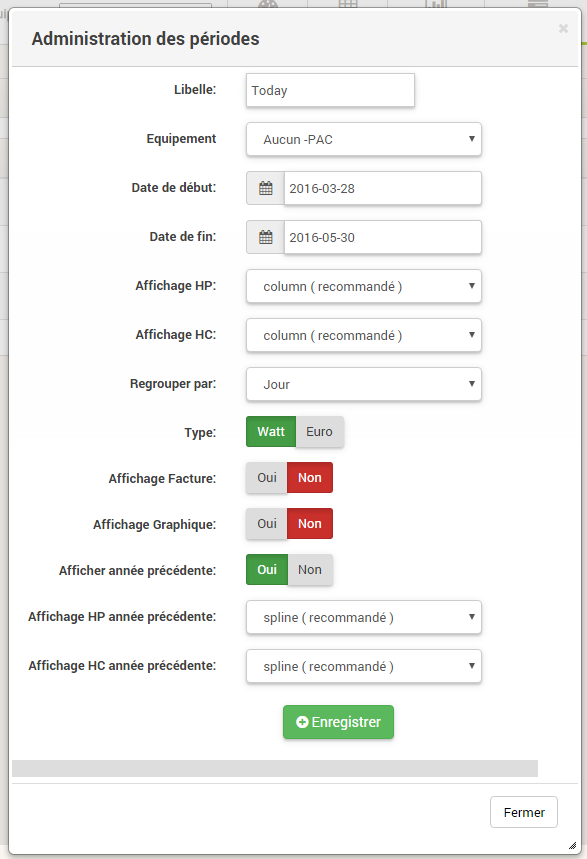


## Prix
Cet onglet permet de configurer les prix pour le détail de votre facture, des tableaux sur la page d'accueil et du détail de chaque graphique<br> 
**<span style="color:red">Lors de la création ou de la modification du prix une synchro jour est lancée pour recalculer les prix.** </span>
Les prix sont HT <br>
Pour ajouter un prix il faut cliquer sur "Ajouter un Prix " <br>
Pour éditer un prix il faut cliquer sur le petit crayon vert <br><br>
En fonction des catégories, la saisie sera différente.<br>
Pour l'électricité:<br><br>
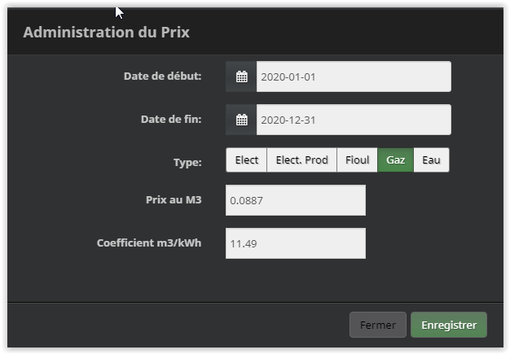

Pour le gaz avec le coefficient de convertion en kWh:<br><br>


<span style="color:red">La valeur ne peut être supérieure à 9.9999</span>
<span style="color:red">Si une valeur supérieure à 9.9999 est renseignée, alors il affichera 9.9999</span> 


## Abo
L'onglet Abo permet de paramétrer le coût de votre abonnement. <br>
Pour ajouter un abonnement il faut cliquer sur "Ajouter un Abonnement" <br>
Pour éditer un abonnement il faut cliquer sur le petit crayon vert <br>

## Les Taxes
Les taxes sont utilisées dans l'onglet Facture. <br>
Lorsqu'une taxe n'est pas calculée par rapport a la consommation, le champ Multiplié doit etre à oui. <br>
Comme par exemple : Contribution Tarifaire d'Acheminement d'électricité (CTA). <br>
Fixe : cette taxe sera dans le calcul des taxes fixes ( graphique taxes TTC )<br>
Variable  : cette taxe sera dans le calcul des taxes variables ( graphique taxes TTC )<br>


## TVA
Cet onglet permet de paramétrer la TVA. <br>
Le champ global est à mettre à Oui pour la TVA à appliquer sur les consommations d'électricité. <br>

## info
Cet onglet affiche les informations techniques des commandes. <br>
Vous pouvez visualiser, modifier et supprimer les informations de la table teleinfo et jour. <br>
Cela vous permet de vérifier le bon fonctionnement du cron et des valeurs. <br>

## Correcteur
La page correcteur permet comme son nom l'indique de corriger les données. Il est possible que votre équipement vous envoie des données erronées. <br>
Pour  corriger les données, selectionner votre période, aidez-vous de la page d'accueil pour connaître exactement le jour ( graphique semaine).<br>
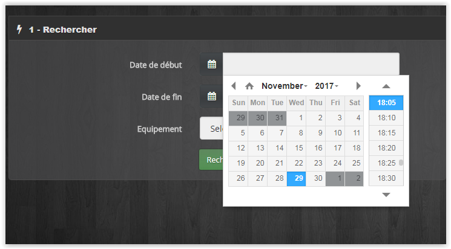

Une fois la recherche effectuée, identifiez une variation à corriger ( heure pleine et/ou heure creuse). <br>

Passer au tableau 2 <br>
Insérer le timstamp du début et de fin en vous aidant du tableau recherche <br>
Si le timestamp de fin n'est pas renseigné alors la correction se fera jusqu'à aujourd'hui. <br>
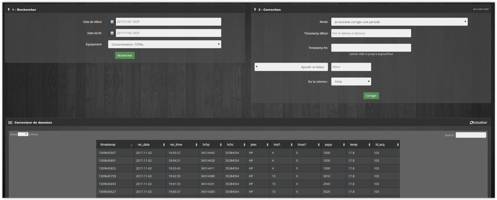


## Outils
Synchroniser Aujourd'hui : permet de recalculer le jour.<br>
Synchroniser les jours : permet de recalculer tous les jours. <br>
**Purger : ATTENTION ce bouton vide votre table teleinfo du plugin, une confirmation est demandée pour poursuivre votre choix.** <br>
Cependant avant de vider la table, par sécurité, une sauvegarde est effectuée automatiquement. <br>
Vous n'avez pas accès à cette table de sauvegarde par l interface. ( à faire ). <br>
Changement ID Equipement : lors de la mise a jour de la V1 vers la V2 , toutes les informations sont mises a jour pour associer les données à un équipement. <br>
Si vous avez des problèmes d'équipement à 0 il faut alors utiliser ce bouton. <br>
**Lien du bouton retour :** pour ajouter une lien sur un bouton retour du menu (A gauche de la sélection de l'équipement dans le menu )<br>
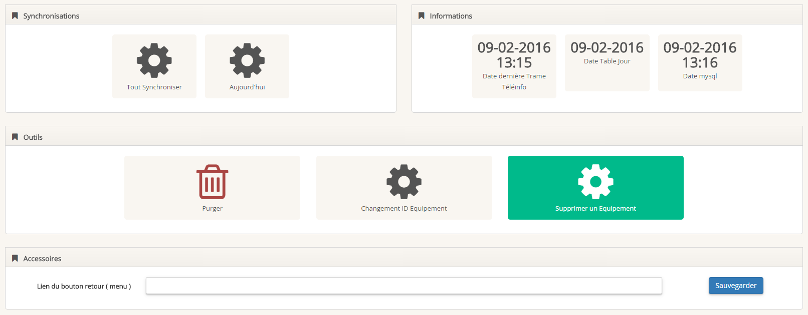


## Changement ID Equipement
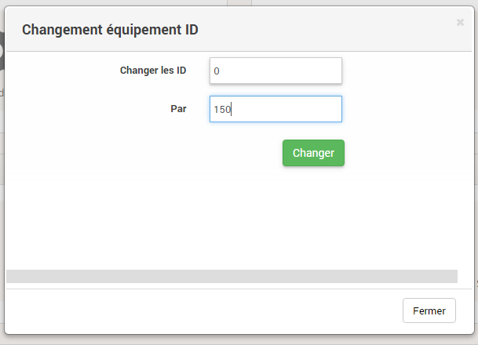


Si vous voulez changer les id 0 par un autre id ( 150 cf image du dessus  ex ) <br>
Tous les ID 0 seront modifiés par 150 <br>

Pour connaître l'id de votre équipement , regarder dans le menu déroulant du menu général du panel <br>


## Supprimer les données d'un équipement
Vous pouvez supprimer les données d'un équipement si vous avez rencontré des problèmes avec une commande <br>
Selectionner la date de début, la date de fin et l'équipement dans la liste déroulante <br>
Les données seront supprimées definitivement selon les critères  <br>
Une synchronisation est nécessaire pour visualiser les corrections dans le panel <br>

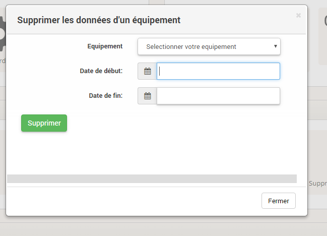

## Sauvegarde / Import
Grâce à cet onglet vous allez pouvoir sauvegarder, importer et historiser vos relevés de consommation . <br>
Il est maintenant possible de sécuriser vos données en cas de crash de la SD, externaliser votre historique et ainsi alléger votre espace de stockage, ainsi le backup jeedom sera plus léger et donc plus rapide. <br>

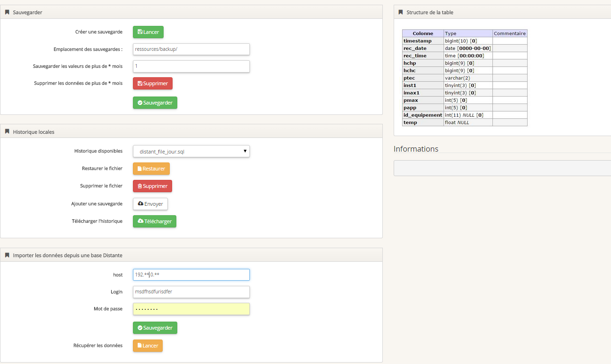


## Créer une sauvegarde
Vous pouvez selectionner l'emplacement du dossier pour vos archives. <br>
Par defaut : ressources/backup/<br><br>

Si vous cliquer sur "créer une sauvegarde" vous pouvez sauvegarder : <br>
 - Toute votre base de données teleinfo <br>
 - Nombre de mois, si le champ "Sauvegarde les valeurs de plus de n mois" est renseigné <br>

Vous pouvez choisir quel type de sauvegarde : <br>

 - Zip : pour gagner de la place sur votre machine <br>
 - SQL : plus souple à utiliser pour effectuer un import sur une autre machine <br>
 - CSV : plus pratique pour comparer des données avec Excel <br>

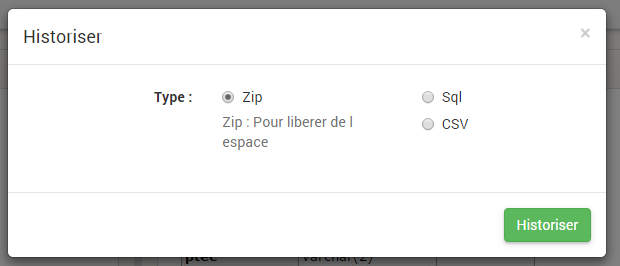


Une fois le backup lancé vous pouvez suivre le traitement dans la partie de droite " Information" <br>
Le traitement terminé, la sauvegarde se trouve dans la liste déroulante et le message suivant s'affiche : <br>

> [END CONSO_HISTORIQUE SUCCESS]


Une fois la sauvegarde créée, vous pouvez supprimer l'historique de plus de n mois. <br>

Vous pouvez maintenant : <br>

- Télécharger cette sauvegarde <br>
- La restaurer <br>
- La supprimer <br>
- Supprimer l'histoique de plus de n mois. <br>

IMPORTANT: ATTENTION ! Avant de supprimer votre historique : assurez vous que le fichier créé est bien valide.<br>

## Import depuis un fichier local
Vous pouvez importer vos données : <br>
Votre fichier doit etre un .sql.gz , un sql<br>

IMPORTANT: ATTENTION - Le Format CSV n'est pas pris en charge pour l'import. <br>


Les champs vides doivent êtres renseignés par defaut (cochés dans le table  colonne Type ) : <br>
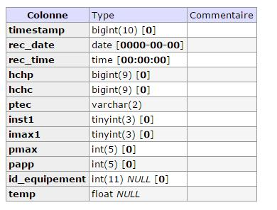


**Liste des champs obligatoires :** <br>

 - timestamp <br>
 - rec_date : AAAA-MM-JJ <br>
 - rec_time  : HH:MM:SS <br>
 - hchp : index HP  sur 9 chiffre <br>
 - hchc : index HC  sur 9 chiffre <br>
 - ptec  : HP ou HC pour l abonnement Heures pleines  / heures creuses sinon mettre HP par defaut. <br>
 - papp  : exemple 3420 <br>


La structure de la table doit être identique au tableau affiché dans l'onglet Save. <br>
<span style='color:red'>**ATTENTION CETTE PROCEDURE EST RESERVEEE AUX PERSONNES CONNAISSANT UN MINIMUM MYSQL**</span><br><br>


## Import Distant


Vous pouvez recupérer les données sur une base distante. <br>
(A faire : automatiser l'import distant pour un fonctionnement en esclave ) <br><br>

Insérer le host, login Mysql et mot de passe Mysql du distant pour vous connecter à la base de données. <br>

Vous pouvez importer les données :

 - Toute la base de données du distant
 - Du jour <br>
 - Du mois <br>
 - De plus de n mois (Si vous avez rempli le champ	 "Sauvegarde les valeurs de plus de n mois" ) <br>

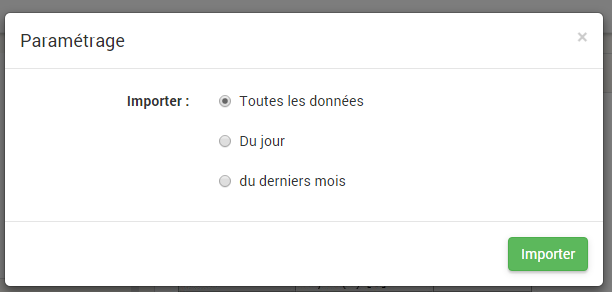


# ATTENTION

Si vous avez un message de ce type : 504 Gateway Time-out <br>
PHP a une limite d'exécution et affiche une erreur quand il arrive au maximum. <br>
Votre import ou votre sauvegarde est toujours en cours , il tourne en tâche de fond. <br>
Attendre le message dans la partie information : <br>

> [END CONSO_HISTORIQUE SUCCESS]


## Requete SQL creation de conso_current

```sql
CREATE OR REPLACE VIEW `conso_current`  AS (SELECT * FROM conso_teleinfo WHERE rec_date = CURRENT_DATE() OR rec_date = DATE_SUB(CURRENT_DATE(), INTERVAL 1 DAY));
```


## Requete SQL creation Jour

```sql
		REPLACE INTO conso_jour (`timestamp`,rec_date,periode,hp,hc,idx_max_hp,idx_min_hp,idx_max_hc,idx_min_hc)
		SELECT
		MIN(`timestamp`) AS `timestamp`  ,`conso_teleinfo`.`rec_date` AS `rec_date`,
		DATE_FORMAT(`conso_teleinfo`.`rec_date`,'%a %e %y') AS `periode`,
		 ((MAX(`hchp`) - MIN(`hchp`)) / 1000)  AS hp,
		 ((MAX(`hchc`) - MIN(`hchc`)) / 1000) AS hc,
		MAX(hchp) as idx_max_hp,
		MIN(hchp) as idx_min_hp,
		MAX(hchc) as idx_max_hc,
		MIN(hchc) as idx_min_hc
		FROM `conso_teleinfo`
		GROUP BY rec_date
		ORDER BY `conso_teleinfo`.`rec_date` desc";

```
## Configuration du plugin : Devise Monétaire

Permet de changer la devise monétaire du plugin


## Configuration du plugin : VARIATION : Insère uniquement si la consommation est > 0

Permet d'insérer uniquement si la consommation est > 0. <br>
Evite le problème si votre module vous retourne une consommation inferieure à la dernière valeur enregistrée <br>


## Configuration du plugin : PUISSANCE : Ne pas insérer la valeur si la puissance est > 50 000

Permet de ne pas insérer la valeur si votre commande retourne une valeur erronée. <br>


